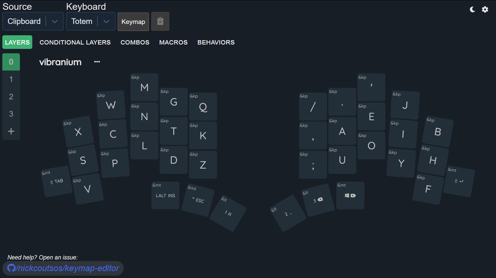
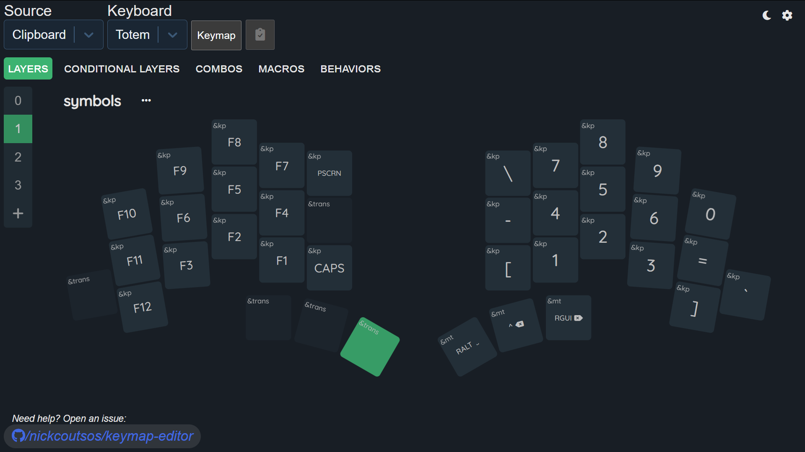
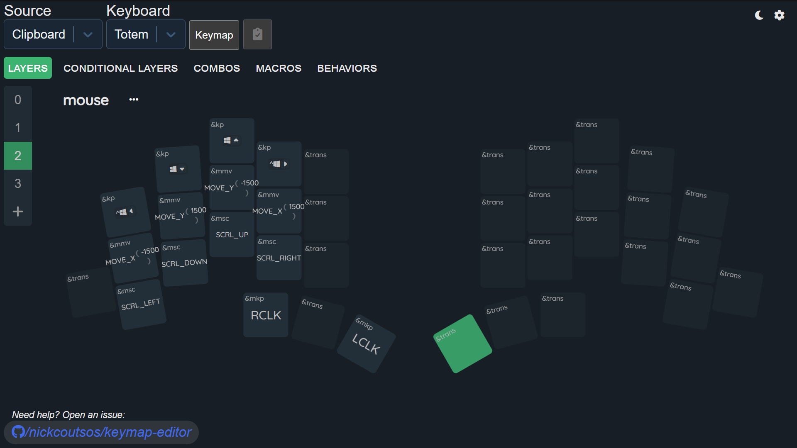
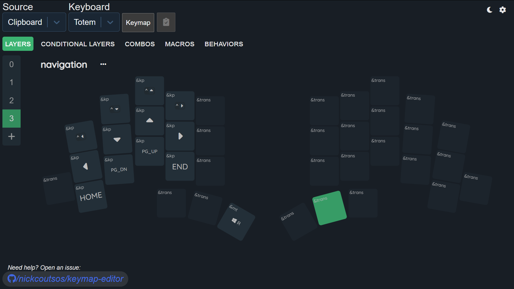

# Vibranium-vv TOTEM keymap

This ZMK keymap for the 34-key [TOTEM](https://github.com/GEIGEIGEIST/TOTEM) aims to reach the best possible health-safety, convenience and speed, by using modified [Hands Down Vibranium](https://sites.google.com/alanreiser.com/handsdown/home/hands-down-neu), mouse integration and thumb modifiers

